<div align="center">


<p>
<a href="https://linkedin.com/in/mujtaba-ahmed-488ba7280"></a>
<a href="mailto:mujtabakhan1036k@gmail.com"></a>
<a href="https://leetcode.com/u/mujii1036/"></a>


</p>

</div>



```python
mujtaba = {
    "name"        : "Mujtaba Ahmed",
    "location"    : "Rawalpindi, Pakistan 🇵🇰",
    "education"   : "B.E. Electrical Engineering @ NUST (2026)",
    "focus"       : ["Backend Systems", "AI Infrastructure", "Distributed Systems"],
    "languages"   : ["Python", "Go", "C++", "JavaScript", "Bash" , "Verilog" , "System Verilog" , "TCL"],
    "daily_driver": "Ubuntu Linux",
    "leetcode"    : "700+ problems solved (Medium/Hard)",
    "currently"   : "Building in public. Open to backend & AI infra roles.",
}
```


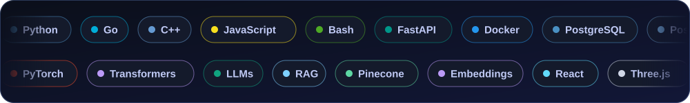


<p align="center">
<a href="https://github.com/mujii88/InstantRAG"></a>
<a href="https://github.com/mujii88/VIGIL"></a>
<a href="https://github.com/mujii88/transformer-from-scratch"></a>
<a href="https://github.com/mujii88/tdoa-localisation"></a>
</p>


<p align="center">


</p>

<p align="center">
<a href="https://git.io/streak-stats"></a>
</p>


<p align="center">
<picture>
  <source media="(prefers-color-scheme: dark)"  srcset="https://raw.githubusercontent.com/mujii88/mujii88/output/github-snake-dark.svg"/>
  <source media="(prefers-color-scheme: light)" srcset="https://raw.githubusercontent.com/mujii88/mujii88/output/github-snake.svg"/>
  
</picture>
</p>


<p align="center">
<a href="https://leetcode.com/u/mujii1036/"></a>
<br/>
<sub><b>700+ problems solved</b> · Medium/Hard focus · Data Structures, Algorithms, System Design</sub>
</p>


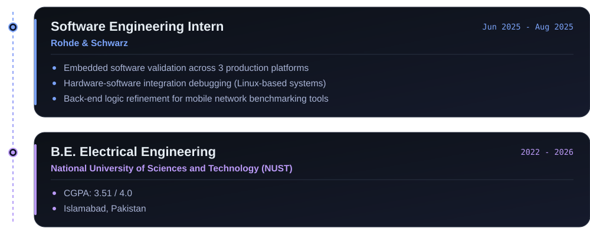

<br/>

<div align="center">

<a href="https://linkedin.com/in/mujtaba-ahmed-488ba7280"></a>
<a href="mailto:mujtabakhan1036k@gmail.com"></a>


</div>
